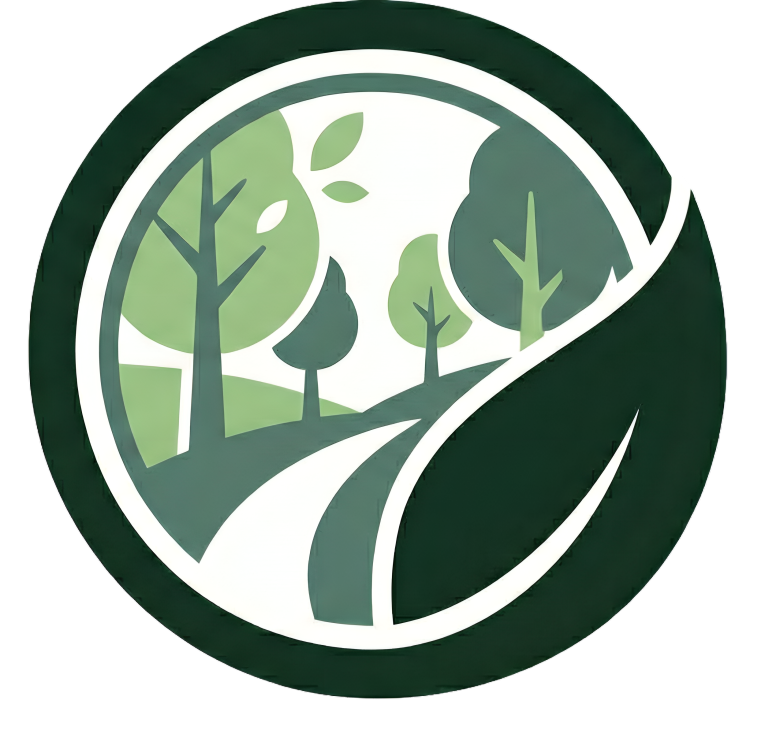

# 📱 GREST — GREEN SPATIAL TRACKING

## 📖 Deskripsi Produk
GREST (Green Spatial Tracking) adalah aplikasi mobile berbasis React Native yang berfungsi untuk menampilkan, memantau, dan menganalisis informasi spasial mengenai sebaran ruang hijau di wilayah perkotaan.  
Aplikasi ini menyediakan visualisasi WebGIS interaktif, tampilan Google Maps untuk navigasi lokasi, halaman profil pengguna, serta halaman analisis berbasis Google Earth Engine (GEE) yang menampilkan hasil olahan citra satelit seperti NDVI, klasifikasi area vegetasi, dan informasi lingkungan lainnya.

GREST dirancang sebagai sarana pemantauan lingkungan yang mudah diakses oleh peneliti, pemerintah daerah, atau masyarakat umum yang ingin mengetahui kondisi ruang hijau secara informatif, real-time, dan berbasis geospasial.

---

## 🛠️ Komponen Pembangun Produk
Teknologi utama yang digunakan dalam pengembangan aplikasi GREST meliputi:

### **Frontend**
- **React Native (Expo)** → Framework utama untuk membangun aplikasi Android/iOS dengan satu basis kode.  
- **React Navigation** → Mengatur navigasi antar-halaman aplikasi.  
- **WebView** → Menampilkan peta WebGIS dalam bentuk halaman HTML interaktif.  
- **Google Maps / react-native-maps** → Menyediakan tampilan peta dan lokasi pengguna langsung.  
- **AsyncStorage** → Menyimpan data sederhana di perangkat.
- **IMGBB** → menyimpan foto yang diunggah pengguna.

### **Backend & Layanan Pendukung**
- **Firebase Authentication** → Autentikasi pengguna menggunakan email & password.  
- **Firebase Firestore / Realtime Database** (opsional) → Penyimpanan data non-spasial.  
- **Google Earth Engine (GEE)** → Sumber analisis dan visualisasi citra satelit.  
- **Server WebGIS (Leaflet, OpenLayers, atau HTML custom)** → Menyimpan dan menampilkan layer sebaran ruang hijau.

### **Tools Lain**
- **Node.js & npm** → Manajemen library, environment, dan pengembangan aplikasi.  
- **Fetch API** → Mengambil data dari API atau server.  

---

## 🔍 Sumber Data
Aplikasi GREST memperoleh data dari beberapa sumber berikut:

- **Citra satelit** (Landsat, Sentinel) melalui Google Earth Engine untuk analisis NDVI, klasifikasi, dan visualisasi area vegetasi non vegetasi.   
- **Basemap** dari Google Maps / OpenStreetMap.  
- **Data pengguna** berupa data partisipasi yang disimpan melalui Firebase Realtime Database.  

---

### 🖼️ Tangkapan Layar

**Google Maps View**  

**Logo / Branding GREST**  

**Halaman Home**  

**Halaman Profil**  

**Form Input Data**  

**Daftar Data (List View)**  

**Halaman Analisis GEE**  

**Peta WebView (Sebaran Ruang Hijau)**  

